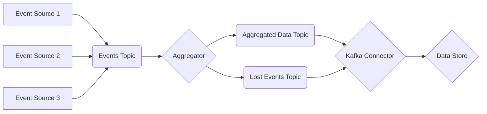

# kafka-aggregation
Aggregating in flight data with Kafka Streams and persistence to long-term storage solutions

```mermaid
graph LR
A[Event Source 1] -->D(Events Topic)
B[Event Source 2] -->D
C[Event Source 3] -->D
    D --> E{Aggregator}
        E --> F(Aggregated Data Topic)
        E --> G(Lost Events Topic)
            F --> H{Kafka Connector}
            G --> H
                H --> I{Data Store}
```